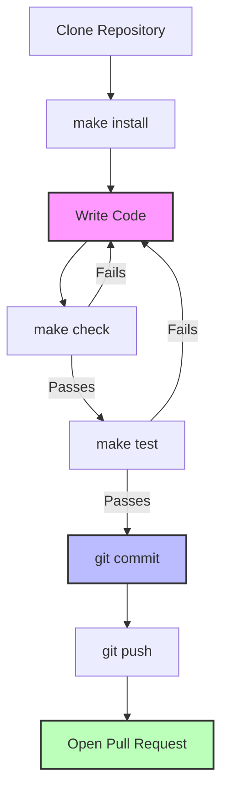

# Contributor Guide

Thank you for your interest in improving this project.
This project is open-source under the [MIT license] and
welcomes contributions in the form of bug reports, feature requests, and pull requests.

Here is a list of important resources for contributors:

- [Source Code]
- [Issue Tracker]
- [Code of Conduct]

[mit license]: https://opensource.org/licenses/MIT
[source code]: https://github.com/aidee-health/embody-serial
[issue tracker]: https://github.com/aidee-health/embody-serial/issues

## How to report a bug

Report bugs on the [Issue Tracker].

When filing an issue, make sure to answer these questions:

- Which operating system and Python version are you using?
- Which version of this project are you using?
- What did you do?
- What did you expect to see?
- What did you see instead?

The best way to get your bug fixed is to provide a test case,
and/or steps to reproduce the issue.

## How to request a feature

Request features on the [Issue Tracker].

## How to set up your development environment

You need Python 3.11+ and the following tools:

- [UV] - Fast Python package installer and resolver
- [tox] - Standardized testing in Python

Install the package with development requirements:

```console
$ make install
```

This will set up your environment using UV and install pre-commit hooks.

You can now run an interactive Python session,
or the command-line interface:

```console
$ uv run python
$ uv run embody-serial
```

[uv]: https://github.com/astral-sh/uv
[tox]: https://tox.wiki/

## How to test the project

Run the full test suite using the Makefile:

```console
$ make test
```

For more complex testing across multiple Python versions, use tox:

```console
$ tox
```

List the available tox environments:

```console
$ tox --listenvs
```

You can also run a specific tox environment:

```console
$ tox -e py312
```

Unit tests are located in the _tests_ directory,
and are written using the [pytest] testing framework.

[pytest]: https://pytest.readthedocs.io/

## How to submit changes

Open a [pull request] to submit changes to this project.

Your pull request needs to meet the following guidelines for acceptance:

- The test suite must pass without errors and warnings across all supported Python versions.
- Include unit tests. This project maintains high code coverage.
- If your changes add functionality, update the documentation accordingly.

Feel free to submit early, though—we can always iterate on this.

To run linting and code formatting checks before committing your change, you can use:

```console
$ make check
```

Pre-commit hooks are installed automatically when you run `make install`, ensuring code quality checks run before each commit.

It is recommended to open an issue before starting work on anything.
This will allow a chance to talk it over with the owners and validate your approach.

## Code Quality Standards

When contributing code, please follow these standards:

### Logging

This library follows Python logging best practices:

- **Use module loggers**: Each module should have `logger = logging.getLogger(__name__)`
- **Never configure root logger**: The library uses its own logger hierarchy (`embodyserial.*`)
- **Performance guards for expensive operations**: Use `if logger.isEnabledFor(logging.LEVEL)` before expensive string formatting or calculations
- **Simple operations don't need guards**: Direct logging calls for simple strings are fine

Example:
```python
import logging
logger = logging.getLogger(__name__)

# Simple logging - no guard needed
logger.info("Processing started")

# Expensive operation - use guard
if logger.isEnabledFor(logging.DEBUG):
    logger.debug(f"Processed {len(data)} items: {expensive_format(data)}")
```

### Threading Architecture

This library uses multiple thread executors for different purposes to prevent callback starvation:

1. **Send Executor** (1 worker): Serializes all send operations
2. **Message Callback Executor** (1 worker): Handles incoming messages from device
3. **Response Callback Executor** (1 worker): Handles responses to sent messages (critical path)
4. **File Download Callback Executor** (1 worker): Handles file transfer progress/completion

**Why Three Separate Callback Executors?**

The separation of callback executors prevents a critical deadlock scenario:
- If message callbacks call `send()` and block waiting for responses
- Response callbacks MUST execute to unblock those sends
- Sharing a single executor would allow message callbacks to starve response callbacks
- Dedicated response executor ensures responses can always execute

**Guidelines:**
- All public methods must be thread-safe
- Use appropriate locks when accessing shared state
- Avoid long-running operations in callbacks (they block their executor)
- If callbacks need to do heavy work, offload to a separate thread
- Document threading behavior in docstrings

## Using the Makefile

This project includes a Makefile with convenient shortcuts for common development tasks:

| Command            | Description                                                     |
| ------------------ | --------------------------------------------------------------- |
| `make install`     | Set up the development environment and install pre-commit hooks |
| `make check`       | Run code quality checks (linting, formatting)                   |
| `make test`        | Run the test suite with pytest                                  |
| `make build`       | Build the package (wheel and sdist)                             |
| `make clean-build` | Remove build artifacts                                          |
| `make help`        | Display all available commands                                  |

## Development Workflow



## Resources

- [Python Package tutorial](https://packaging.python.org/en/latest/tutorials/packaging-projects/)
- [Best practices for project structure according to pytest](https://docs.pytest.org/en/latest/explanation/goodpractices.html)
- [Using GitHub as a private PiPI server](https://medium.com/network-letters/using-github-as-a-private-python-package-index-server-798a6e1cfdef)
- [Project structure - rationale and best practice](https://blog.ionelmc.ro/2014/05/25/python-packaging)
- [Threading Howto](https://superfastpython.com/threading-in-python/)

[pull request]: https://github.com/aidee-health/embody-serial/pulls
